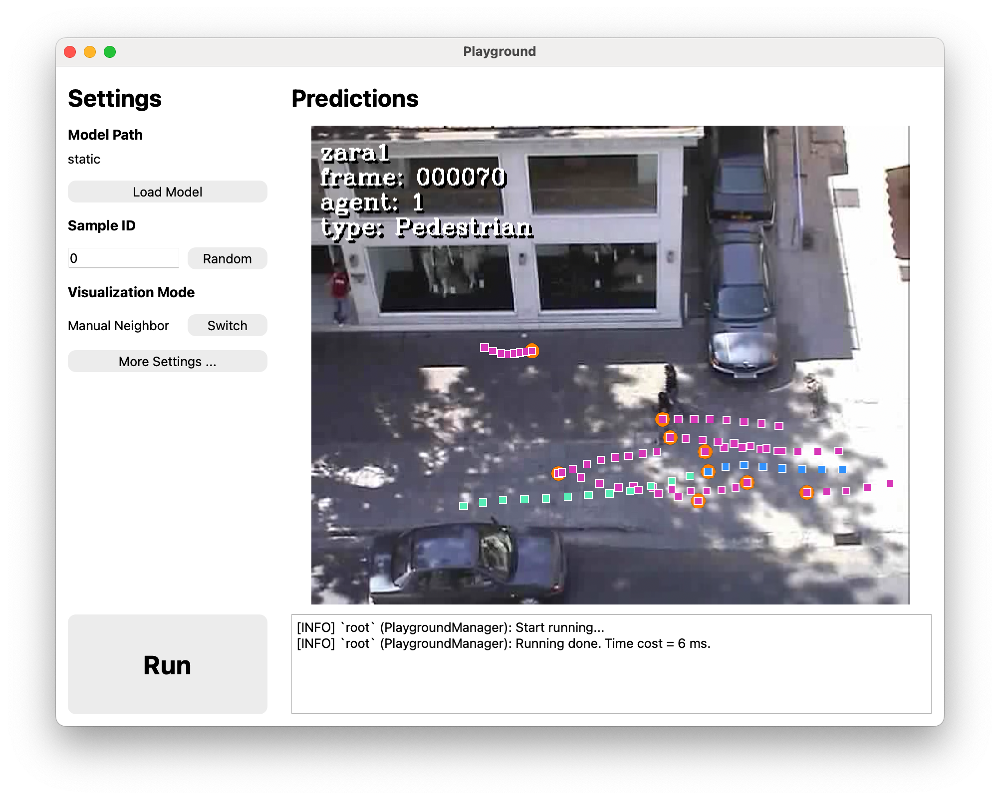

<!--
 * @Author: Conghao Wong
 * @Date: 2025-01-15 15:31:57
 * @LastEditors: Conghao Wong
 * @LastEditTime: 2025-11-17 10:17:25
 * @Github: https://cocoon2wong.github.io
 * Copyright 2025 Conghao Wong, All Rights Reserved.
-->

# Reverberation

This is the official code of our paper "Reverberation: Learning the Latencies Before Forecasting Trajectories".
The full paper is now avaliable at [https://arxiv.org/abs/2511.11164](https://arxiv.org/abs/2511.11164).
Our model weights are available at [here](https://github.com/cocoon2wong/Project-Monandaeg/tree/Rev).

## Authors' Note

This work is the third part in our *Echolocation Trilogy*.
It describes and predicts how long agents' echoes from the past last in the future.

Here are all the repositories involved in our trilogy:

- Part I, **Where do the echoes come from?**: [*SocialCircle*](https://github.com/cocoon2wong/SocialCircle)  (CVPR 2024) and [*SocialCirclePlus*](https://github.com/cocoon2wong/SocialCirclePlus) (Journal, Under Review);
- Part II, **How echoes interact with each other?**: [*Resonance*](https://github.com/cocoon2wong/Re) (ICCV 2025);
- Part III, **How long do the echoes last?**: [*Reverberation*](https://github.com/cocoon2wong/Rev) (Journal, Under Review).

Note that these repositories share the same training engine and the weight files are compatible with each other (in the order in which the repositories were released, the later released repositories are compatible with the weights of the previous releases, the [*Reverberation*](https://github.com/cocoon2wong/Rev) repository is recommended as it is compatible with all previous models).
You can copy only the core model folders, e.g. `SocialCircle`, `Re`, `Rev`, etc., to a repository's root path (i.e., the folder where `qpid` is located), and train and test the models via `main.py`.

## Getting Started

You can clone [this repository](https://github.com/cocoon2wong/Rev) by the following command:

```bash
git clone https://github.com/cocoon2wong/Rev.git
```

Then, run the following command to initialize all submodules:

```bash
git submodule update --init --recursive
```

## Requirements

The code is developed with Python 3.10.
Additional packages used are included in the `requirements.txt` file.

> [!WARNING]
> We recommend installing all required Python packages in a virtual environment (like the `conda` environment).
> Otherwise, there *COULD* be other problems due to the package version conflicts.

Run the following command to install the required packages in your Python environment:

```bash
pip install -r requirements.txt
```

## Preparing Datasets

### ETH-UCY, SDD, NBA, nuScenes

> [!WARNING]
> If you want to validate `Rev` models on these datasets, make sure you are getting this repository via `git clone` and that all *git submodules* have been properly initialized via `git submodule update --init --recursive`.

You can run the following commands to prepare dataset files that have been validated in our paper:

1. Run Python the script inner the `dataset_original` folder:

    ```bash
    cd dataset_original
    ```

    - For `ETH-UCY` and `SDD`, run

        ```bash
        python main_ethucysdd.py
        ```

        > [!NOTE]
        > Our reported results and provided weights on the `eth` set is actually the 6-frame-interval version.
        > To test the 10-frame-sampled eth, please run `python codes/ethucy/create_10sampled_eth_data.py`, then use the clip name `eth10` to train or test models.
        > For more information and notes our used datasets and splits, please refer to [this page](https://projectunpredictable.com/Project-Qpid/docs/dataset/dataset-and-split-notes/).

    - For `nuScenes`, please download their dataset files, put them into the given path listed within `dataset_original/main_nuscenes.py`, then run

        ```bash
        python main_nuscenes.py
        ```

    - For `Human3.6M`, please download their dataset files, put them into the given path listed within `dataset_original/main_h36m.py`, then run

        ```bash
        python main_h36m.py
        ```

2. Back to the repo folder and create soft links:

    ```bash
    cd ..
    ln -s dataset_original/dataset_processed ./
    ln -s dataset_original/dataset_configs ./
    ```

> [!NOTE]
> You can also download our processed dataset files manually from [here](https://github.com/cocoon2wong/Project-Luna/releases), and put them into `dataset_processed` and `dataset_configs` folders manually to reproduce our results.
> Due to size limits, processed dataset files of the `Human3.6M` dataset is available at [here](https://github.com/cocoon2wong/Project-Monandaeg/releases).

Click the following buttons to learn how we process these dataset files and the detailed dataset settings.

<div style="text-align: center;">
    <a class="btn btn-colorful btn-lg" href="https://cocoon2wong.github.io/Project-Luna/howToUse/">💡 Dataset Guidelines</a>
    <a class="btn btn-colorful btn-lg" href="https://cocoon2wong.github.io/Project-Luna/notes/">💡 Datasets and Splits Information</a>
</div>

### Training on Your New Datasets

Before training `Rev` models on your own dataset, you should add your dataset information.
See [this page](https://cocoon2wong.github.io/Project-Luna/) for more details.

## Model Weights

We have provided our pre-trained model weights to help you quickly evaluate `Rev` models' performance.

Click the following buttons to download our model weights.
We recommend that you download the weights and place them in the `weights` folder.

<div style="text-align: center;">
    <a class="btn btn-colorful btn-lg" href="https://github.com/cocoon2wong/Project-Monandaeg/tree/Rev">⬇️ Download Weights</a>
</div>

You can start evaluating these weights by

```bash
python main.py --load SOME_MODEL_WEIGHTS
```

Here, `SOME_MODEL_WEIGHTS` is the path of the weights folder, for example, `./weights/rezara1`.

## Training

You can start training a `Rev` model via the following command:

```bash
python main.py --model rev --split DATASET_SPLIT
```

Here, `DATASET_SPLIT` is the identifier (i.e., the name of dataset's split files in `dataset_configs`, for example `eth` is the identifier of the split list in `dataset_configs/ETH-UCY/eth.plist`) of the dataset or splits used for training.
It accepts:

- ETH-UCY: {`eth`, `hotel`, `univ13`, `zara1`, `zara2`};
- SDD: `sdd`;
- nuScenes: `nuScenes_ov_v1.0`;
- Human3.6M: `h36m`.

For example, you can start training the `Rev` model on the `zara1` split by

```bash
python main.py --model rev --split zara1
```

Also, other args may need to be specified, like the learning rate `--lr`, batch size `--batch_size`, etc.
See detailed args in the `Args Used` Section.

## Reproducing Our Results

The simplest way to reproduce our results is to copy all training args we used in the provided weights.
For example, you can start a training of `Rev` on `zara1` using the same args as we did by:

```bash
python main.py --model rev --restore_args ${PATH_TO_YOUR_DOWNLOADED_WEIGHTS}/revzara1
```

Here, `${PATH_TO_YOUR_DOWNLOADED_WEIGHTS}` is your path to save our pretrained weights, which usually could be named as `Project-Monandaeg-Rev` after downloading.

You can open a `Tensorboard` to see how losses and metrics change during training, by:

```bash
tensorboard --logdir ./logs
```

## Visualization & Playground

We have build a simple user interface to validate the qualitative trajectory prediction performance of our proposed `Rev` models.
You can use it to visualize model predictions and learn how the proposed `Rev` works to handle social interactions in an interactive way by adding any manual neighbors at any positions in the scene.

> [!WARNING]
> Visualizations may need dataset videos. For copyright reasons and size limitations, we do not provide them in our repo. Instead, a static image will be displayed if you have no videos put into the corresponding path.

### Visualization Requirements

This playground interface is implemented with `PyQt6`.
Install this package in your python environment to start:

```bash
pip install pyqt6
```

### Open a Playground

Run the following command to open a playground:

```bash
python playground/main.py
```



### Load Models and Datasets

You can load a supported `Rev` model or one of its variations by clicking the `Load Model` button.
By clicking the `Run` button, you can see how the loaded model performs on the given sample.
You can also load different datasets (video clips) by clicking the `More Settings ...` button.

### Add Manual Neighbors

You can also directly click the visualized figure to add a new neighbor to the scene.
Through this neighbor that wasn't supposed to exist in the prediction scene, you can verify how models handle *social interactions* qualitatively.

### Visualized Social Modifications

You can use the following command to visualize how a manual neighbor modifies the ego-agent's predicted trajectories, especially in the form of our defined *social modification*:

```bash
python playground/main.py --compute_social_mod
```

Load a model (the `Load Model` button), add a manual neighbor (click on the right canvas twice), then click the left `Compute Social Modifications` to start visualize.
The printed results are similar to our main paper's last figure.
Try to explore how our model handles social interactions in this way!

## Contact us

Conghao Wong ([@cocoon2wong](https://github.com/cocoon2wong)): conghaowong@icloud.com  
Ziqian Zou ([@LivepoolQ](https://github.com/LivepoolQ)): ziqianzoulive@icloud.com

<!-- DO NOT CHANGE THIS LINE -->
---

## Args Used

Please specify your customized args when training or testing your model in the following way:

```bash
python main.py --ARG_KEY1 ARG_VALUE2 --ARG_KEY2 ARG_VALUE2 -SHORT_ARG_KEY3 ARG_VALUE3 ...
```

where `ARG_KEY` is the name of args, and `ARG_VALUE` is the corresponding value.
All args and their usages are listed below.

About the `argtype`:

- Args with argtype=`static` can not be changed once after training.
  When testing the model, the program will not parse these args to overwrite the saved values.
- Args with argtype=`dynamic` can be changed anytime.
  The program will try to first parse inputs from the terminal and then try to load from the saved JSON file.
- Args with argtype=`temporary` will not be saved into JSON files.
  The program will parse these args from the terminal at each time.

### Basic Args


<details>
    <summary>
        <code>--K</code>
    </summary>
    <p>
        The number of multiple generations when testing. This arg only works for multiple-generation models.
    </p>
    <ul>
        <li>Type=<code>int</code>, argtype=<code>dynamic</code>;</li>
        <li>The default value is <code>20</code>.</li>
    </ul>
</details>

<details>
    <summary>
        <code>--K_train</code>
    </summary>
    <p>
        The number of multiple generations when training. This arg only works for multiple-generation models.
    </p>
    <ul>
        <li>Type=<code>int</code>, argtype=<code>static</code>;</li>
        <li>The default value is <code>10</code>.</li>
    </ul>
</details>

<details>
    <summary>
        <code>--anntype</code>
    </summary>
    <p>
        Model's predicted annotation type. Can be <code>'coordinate'</code> or <code>'boundingbox'</code>.
    </p>
    <ul>
        <li>Type=<code>str</code>, argtype=<code>static</code>;</li>
        <li>The default value is <code>coordinate</code>.</li>
    </ul>
</details>

<details>
    <summary>
        <code>--auto_clear</code>
    </summary>
    <p>
        Controls whether to clear all other saved weights except for the best one. It performs similarly to running <code>python scripts/clear.py --logs logs</code>.
    </p>
    <ul>
        <li>Type=<code>int</code>, argtype=<code>temporary</code>;</li>
        <li>The default value is <code>1</code>.</li>
    </ul>
</details>

<details>
    <summary>
        <code>--batch_size</code> (short for <code>-bs</code>)
    </summary>
    <p>
        Batch size when implementation.
    </p>
    <ul>
        <li>Type=<code>int</code>, argtype=<code>dynamic</code>;</li>
        <li>The default value is <code>5000</code>.</li>
    </ul>
</details>

<details>
    <summary>
        <code>--compute_loss</code>
    </summary>
    <p>
        Controls whether to compute losses when testing.
    </p>
    <ul>
        <li>Type=<code>int</code>, argtype=<code>temporary</code>;</li>
        <li>The default value is <code>0</code>.</li>
    </ul>
</details>

<details>
    <summary>
        <code>--compute_metrics_with_types</code>
    </summary>
    <p>
        Controls whether to compute metrics separately on different kinds of agents.
    </p>
    <ul>
        <li>Type=<code>int</code>, argtype=<code>temporary</code>;</li>
        <li>The default value is <code>0</code>.</li>
    </ul>
</details>

<details>
    <summary>
        <code>--compute_statistical_metrics</code>
    </summary>
    <p>
        (bool) Choose whether to compute metrics (ADE/FDE) as <code>mean $\pm$ std</code>.
    </p>
    <ul>
        <li>Type=<code>int</code>, argtype=<code>temporary</code>;</li>
        <li>The default value is <code>0</code>.</li>
    </ul>
</details>

<details>
    <summary>
        <code>--dataset</code>
    </summary>
    <p>
        Name of the video dataset to train or evaluate. For example, <code>'ETH-UCY'</code> or <code>'SDD'</code>. NOTE: DO NOT set this argument manually.
    </p>
    <ul>
        <li>Type=<code>str</code>, argtype=<code>static</code>;</li>
        <li>The default value is <code>Unavailable</code>.</li>
    </ul>
</details>

<details>
    <summary>
        <code>--down_sampling_rate</code>
    </summary>
    <p>
        Selects whether to down-sample from multiple-generated predicted trajectories. This arg only works for multiple-generative models.
    </p>
    <ul>
        <li>Type=<code>float</code>, argtype=<code>temporary</code>;</li>
        <li>The default value is <code>1.0</code>.</li>
    </ul>
</details>

<details>
    <summary>
        <code>--draw_results</code> (short for <code>-dr</code>)
    </summary>
    <p>
        Controls whether to draw visualized results on video frames. Accept the name of one video clip. The codes will first try to load the video file according to the path saved in the <code>plist</code> file (saved in <code>dataset_configs</code> folder), and if it loads successfully it will draw the results on that video, otherwise it will draw results on a blank canvas. Note that <code>test_mode</code> will be set to <code>'one'</code> and <code>force_split</code> will be set to <code>draw_results</code> if <code>draw_results != 'null'</code>.
    </p>
    <ul>
        <li>Type=<code>str</code>, argtype=<code>temporary</code>;</li>
        <li>The default value is <code>null</code>.</li>
    </ul>
</details>

<details>
    <summary>
        <code>--draw_videos</code>
    </summary>
    <p>
        Controls whether to draw visualized results on video frames and save them as images. Accept the name of one video clip. The codes will first try to load the video according to the path saved in the <code>plist</code> file, and if successful it will draw the visualization on the video, otherwise it will draw on a blank canvas. Note that <code>test_mode</code> will be set to <code>'one'</code> and <code>force_split</code> will be set to <code>draw_videos</code> if <code>draw_videos != 'null'</code>.
    </p>
    <ul>
        <li>Type=<code>str</code>, argtype=<code>temporary</code>;</li>
        <li>The default value is <code>null</code>.</li>
    </ul>
</details>

<details>
    <summary>
        <code>--epochs</code>
    </summary>
    <p>
        Maximum training epochs.
    </p>
    <ul>
        <li>Type=<code>int</code>, argtype=<code>static</code>;</li>
        <li>The default value is <code>500</code>.</li>
    </ul>
</details>

<details>
    <summary>
        <code>--experimental</code>
    </summary>
    <p>
        NOTE: It is only used for code tests.
    </p>
    <ul>
        <li>Type=<code>bool</code>, argtype=<code>temporary</code>;</li>
        <li>The default value is <code>False</code>.</li>
    </ul>
</details>

<details>
    <summary>
        <code>--feature_dim</code>
    </summary>
    <p>
        Feature dimensions that are used in most layers.
    </p>
    <ul>
        <li>Type=<code>int</code>, argtype=<code>static</code>;</li>
        <li>The default value is <code>128</code>.</li>
    </ul>
</details>

<details>
    <summary>
        <code>--force_anntype</code>
    </summary>
    <p>
        Assign the prediction type. It is now only used for silverballers models that are trained with annotation type <code>coordinate</code> but to be tested on datasets with annotation type <code>boundingbox</code>.
    </p>
    <ul>
        <li>Type=<code>str</code>, argtype=<code>temporary</code>;</li>
        <li>The default value is <code>null</code>.</li>
    </ul>
</details>

<details>
    <summary>
        <code>--force_clip</code>
    </summary>
    <p>
        Force test video clip (ignore the train/test split). It only works when <code>test_mode</code> has been set to <code>one</code>.
    </p>
    <ul>
        <li>Type=<code>str</code>, argtype=<code>temporary</code>;</li>
        <li>The default value is <code>null</code>.</li>
    </ul>
</details>

<details>
    <summary>
        <code>--force_dataset</code>
    </summary>
    <p>
        Force test dataset (ignore the train/test split). It only works when <code>test_mode</code> has been set to <code>one</code>.
    </p>
    <ul>
        <li>Type=<code>str</code>, argtype=<code>temporary</code>;</li>
        <li>The default value is <code>null</code>.</li>
    </ul>
</details>

<details>
    <summary>
        <code>--force_split</code>
    </summary>
    <p>
        Force test dataset (ignore the train/test split). It only works when <code>test_mode</code> has been set to <code>one</code>.
    </p>
    <ul>
        <li>Type=<code>str</code>, argtype=<code>temporary</code>;</li>
        <li>The default value is <code>null</code>.</li>
    </ul>
</details>

<details>
    <summary>
        <code>--gpu</code>
    </summary>
    <p>
        Speed up training or test if you have at least one NVidia GPU. If you have no GPUs or want to run the code on your CPU, please set it to <code>-1</code>. NOTE: It only supports training or testing on one GPU.
    </p>
    <ul>
        <li>Type=<code>str</code>, argtype=<code>temporary</code>;</li>
        <li>The default value is <code>0</code>.</li>
    </ul>
</details>

<details>
    <summary>
        <code>--help</code> (short for <code>-h</code>)
    </summary>
    <p>
        Print help information on the screen.
    </p>
    <ul>
        <li>Type=<code>str</code>, argtype=<code>temporary</code>;</li>
        <li>The default value is <code>null</code>.</li>
    </ul>
</details>

<details>
    <summary>
        <code>--input_pred_steps</code>
    </summary>
    <p>
        Indices of future time steps that are used as extra model inputs. It accepts a string that contains several integer numbers separated with <code>'_'</code>. For example, <code>'3_6_9'</code>. It will take the corresponding ground truth points as the input when training the model, and take the first output of the former network as this input when testing the model. Set it to <code>'null'</code> to disable these extra model inputs.
    </p>
    <ul>
        <li>Type=<code>str</code>, argtype=<code>static</code>;</li>
        <li>The default value is <code>null</code>.</li>
    </ul>
</details>

<details>
    <summary>
        <code>--interval</code>
    </summary>
    <p>
        Time interval of each sampled trajectory point.
    </p>
    <ul>
        <li>Type=<code>float</code>, argtype=<code>static</code>;</li>
        <li>The default value is <code>0.4</code>.</li>
    </ul>
</details>

<details>
    <summary>
        <code>--load</code> (short for <code>-l</code>)
    </summary>
    <p>
        Folder to load model weights (to test). If it is set to <code>null</code>, the training manager will start training new models according to other reveived args. NOTE: Leave this arg to <code>null</code> when training new models.
    </p>
    <ul>
        <li>Type=<code>str</code>, argtype=<code>temporary</code>;</li>
        <li>The default value is <code>null</code>.</li>
    </ul>
</details>

<details>
    <summary>
        <code>--load_epoch</code>
    </summary>
    <p>
        Load model weights that is saved after specific training epochs. It will try to load the weight file in the <code>load</code> dir whose name is end with <code>_epoch${load_epoch}</code>. This arg only works when the <code>auto_clear</code> arg is disabled (by passing <code>--auto_clear 0</code> when training). Set it to <code>-1</code> to disable this function.
    </p>
    <ul>
        <li>Type=<code>int</code>, argtype=<code>temporary</code>;</li>
        <li>The default value is <code>-1</code>.</li>
    </ul>
</details>

<details>
    <summary>
        <code>--load_part</code>
    </summary>
    <p>
        Choose whether to load only a part of the model weights if the <code>state_dict</code> of the saved model and the model in the code do not match. *IMPORTANT NOTE*: This arg is only used for some ablation experiments. It MAY lead to incorrect predictions or metrics.
    </p>
    <ul>
        <li>Type=<code>int</code>, argtype=<code>temporary</code>;</li>
        <li>The default value is <code>0</code>.</li>
    </ul>
</details>

<details>
    <summary>
        <code>--log_dir</code>
    </summary>
    <p>
        Folder to save training logs and model weights. Logs will save at <code>${save_base_dir}/${log_dir}</code>. DO NOT change this arg manually. (You can still change the saving path by passing the <code>save_base_dir</code> arg.).
    </p>
    <ul>
        <li>Type=<code>str</code>, argtype=<code>static</code>;</li>
        <li>The default value is <code>Unavailable</code>.</li>
    </ul>
</details>

<details>
    <summary>
        <code>--loss_weights</code>
    </summary>
    <p>
        Configure the agent-wise loss weights. It now only supports the dataset-clip-wise re-weight.
    </p>
    <ul>
        <li>Type=<code>str</code>, argtype=<code>dynamic</code>;</li>
        <li>The default value is <code>{}</code>.</li>
    </ul>
</details>

<details>
    <summary>
        <code>--lr</code> (short for <code>-lr</code>)
    </summary>
    <p>
        Learning rate.
    </p>
    <ul>
        <li>Type=<code>float</code>, argtype=<code>static</code>;</li>
        <li>The default value is <code>0.001</code>.</li>
    </ul>
</details>

<details>
    <summary>
        <code>--macos</code>
    </summary>
    <p>
        (Experimental) Choose whether to enable the <code>MPS (Metal Performance Shaders)</code> on Apple platforms (instead of running on CPUs).
    </p>
    <ul>
        <li>Type=<code>int</code>, argtype=<code>temporary</code>;</li>
        <li>The default value is <code>0</code>.</li>
    </ul>
</details>

<details>
    <summary>
        <code>--max_agents</code>
    </summary>
    <p>
        Max number of agents to predict per frame. It only works when <code>model_type == 'frame-based'</code>.
    </p>
    <ul>
        <li>Type=<code>int</code>, argtype=<code>static</code>;</li>
        <li>The default value is <code>50</code>.</li>
    </ul>
</details>

<details>
    <summary>
        <code>--model</code>
    </summary>
    <p>
        The model type used to train or test.
    </p>
    <ul>
        <li>Type=<code>str</code>, argtype=<code>static</code>;</li>
        <li>The default value is <code>none</code>.</li>
    </ul>
</details>

<details>
    <summary>
        <code>--model_name</code>
    </summary>
    <p>
        Customized model name.
    </p>
    <ul>
        <li>Type=<code>str</code>, argtype=<code>static</code>;</li>
        <li>The default value is <code>model</code>.</li>
    </ul>
</details>

<details>
    <summary>
        <code>--model_type</code>
    </summary>
    <p>
        Model type. It can be <code>'agent-based'</code> or <code>'frame-based'</code>.
    </p>
    <ul>
        <li>Type=<code>str</code>, argtype=<code>static</code>;</li>
        <li>The default value is <code>agent-based</code>.</li>
    </ul>
</details>

<details>
    <summary>
        <code>--noise_depth</code>
    </summary>
    <p>
        Depth of the random noise vector.
    </p>
    <ul>
        <li>Type=<code>int</code>, argtype=<code>static</code>;</li><li>This arg can also be spelled as<code>--depth</code>;</li>
        <li>The default value is <code>16</code>.</li>
    </ul>
</details>

<details>
    <summary>
        <code>--obs_frames</code> (short for <code>-obs</code>)
    </summary>
    <p>
        Observation frames for prediction.
    </p>
    <ul>
        <li>Type=<code>int</code>, argtype=<code>static</code>;</li>
        <li>The default value is <code>8</code>.</li>
    </ul>
</details>

<details>
    <summary>
        <code>--output_pred_steps</code>
    </summary>
    <p>
        Indices of future time steps to be predicted. It accepts a string that contains several integer numbers separated with <code>'_'</code>. For example, <code>'3_6_9'</code>. Set it to <code>'all'</code> to predict points among all future steps.
    </p>
    <ul>
        <li>Type=<code>str</code>, argtype=<code>static</code>;</li><li>This arg can also be spelled as<code>--key_points</code>;</li>
        <li>The default value is <code>all</code>.</li>
    </ul>
</details>

<details>
    <summary>
        <code>--pmove</code>
    </summary>
    <p>
        (Pre/post-process Arg) Index of the reference point when moving trajectories.
    </p>
    <ul>
        <li>Type=<code>int</code>, argtype=<code>static</code>;</li>
        <li>The default value is <code>-1</code>.</li>
    </ul>
</details>

<details>
    <summary>
        <code>--pred_frames</code> (short for <code>-pred</code>)
    </summary>
    <p>
        Prediction frames.
    </p>
    <ul>
        <li>Type=<code>int</code>, argtype=<code>static</code>;</li>
        <li>The default value is <code>12</code>.</li>
    </ul>
</details>

<details>
    <summary>
        <code>--preprocess</code>
    </summary>
    <p>
        Controls whether to run any pre-process before the model inference. It accepts a 3-bit-like string value (like <code>'111'</code>): - The first bit: <code>MOVE</code> trajectories to (0, 0); - The second bit: re-<code>SCALE</code> trajectories; - The third bit: <code>ROTATE</code> trajectories.
    </p>
    <ul>
        <li>Type=<code>str</code>, argtype=<code>static</code>;</li>
        <li>The default value is <code>100</code>.</li>
    </ul>
</details>

<details>
    <summary>
        <code>--restore</code>
    </summary>
    <p>
        Path to restore the pre-trained weights before training. It will not restore any weights if <code>args.restore == 'null'</code>.
    </p>
    <ul>
        <li>Type=<code>str</code>, argtype=<code>temporary</code>;</li>
        <li>The default value is <code>null</code>.</li>
    </ul>
</details>

<details>
    <summary>
        <code>--restore_args</code>
    </summary>
    <p>
        Path to restore the reference args before training. It will not restore any args if <code>args.restore_args == 'null'</code>.
    </p>
    <ul>
        <li>Type=<code>str</code>, argtype=<code>temporary</code>;</li>
        <li>The default value is <code>null</code>.</li>
    </ul>
</details>

<details>
    <summary>
        <code>--save_base_dir</code>
    </summary>
    <p>
        Base folder to save all running logs.
    </p>
    <ul>
        <li>Type=<code>str</code>, argtype=<code>static</code>;</li>
        <li>The default value is <code>./logs</code>.</li>
    </ul>
</details>

<details>
    <summary>
        <code>--split</code> (short for <code>-s</code>)
    </summary>
    <p>
        The dataset split that used to train and evaluate.
    </p>
    <ul>
        <li>Type=<code>str</code>, argtype=<code>static</code>;</li>
        <li>The default value is <code>zara1</code>.</li>
    </ul>
</details>

<details>
    <summary>
        <code>--start_test_percent</code>
    </summary>
    <p>
        Set when (at which epoch) to start validation during training. The range of this arg should be <code>0 <= x <= 1</code>. Validation may start at epoch <code>args.epochs * args.start_test_percent</code>.
    </p>
    <ul>
        <li>Type=<code>float</code>, argtype=<code>temporary</code>;</li>
        <li>The default value is <code>0.0</code>.</li>
    </ul>
</details>

<details>
    <summary>
        <code>--step</code>
    </summary>
    <p>
        Frame interval for sampling training data.
    </p>
    <ul>
        <li>Type=<code>float</code>, argtype=<code>dynamic</code>;</li>
        <li>The default value is <code>1.0</code>.</li>
    </ul>
</details>

<details>
    <summary>
        <code>--test_mode</code>
    </summary>
    <p>
        Test settings. It can be <code>'one'</code>, <code>'all'</code>, or <code>'mix'</code>. When setting it to <code>one</code>, it will test the model on the <code>args.force_split</code> only; When setting it to <code>all</code>, it will test on each of the test datasets in <code>args.split</code>; When setting it to <code>mix</code>, it will test on all test datasets in <code>args.split</code> together.
    </p>
    <ul>
        <li>Type=<code>str</code>, argtype=<code>temporary</code>;</li>
        <li>The default value is <code>mix</code>.</li>
    </ul>
</details>

<details>
    <summary>
        <code>--test_step</code>
    </summary>
    <p>
        Epoch interval to run validation during training.
    </p>
    <ul>
        <li>Type=<code>int</code>, argtype=<code>temporary</code>;</li>
        <li>The default value is <code>1</code>.</li>
    </ul>
</details>

<details>
    <summary>
        <code>--update_saved_args</code>
    </summary>
    <p>
        Choose whether to update (overwrite) the saved arg files or not.
    </p>
    <ul>
        <li>Type=<code>int</code>, argtype=<code>temporary</code>;</li>
        <li>The default value is <code>0</code>.</li>
    </ul>
</details>

<details>
    <summary>
        <code>--verbose</code> (short for <code>-v</code>)
    </summary>
    <p>
        Controls whether to print verbose logs and outputs to the terminal.
    </p>
    <ul>
        <li>Type=<code>int</code>, argtype=<code>temporary</code>;</li>
        <li>The default value is <code>0</code>.</li>
    </ul>
</details>

### Reverberation Args


<details>
    <summary>
        <code>--Kc</code>
    </summary>
    <p>
        The number of generations when making predictions. It is also the channels of the generating kernel in the proposed reverberation transform.
    </p>
    <ul>
        <li>Type=<code>int</code>, argtype=<code>static</code>;</li><li>This arg can also be spelled as<code>--Kg</code>, <code>--K_g</code>;</li>
        <li>The default value is <code>20</code>.</li>
    </ul>
</details>

<details>
    <summary>
        <code>--T</code> (short for <code>-T</code>)
    </summary>
    <p>
        Transform type used to compute trajectory spectrums. It could be: - <code>none</code>: no transformations; - <code>haar</code>: haar wavelet transform; - <code>db2</code>: DB2 wavelet transform.
    </p>
    <ul>
        <li>Type=<code>str</code>, argtype=<code>static</code>;</li>
        <li>The default value is <code>haar</code>.</li>
    </ul>
</details>

<details>
    <summary>
        <code>--compute_linear</code>
    </summary>
    <p>
        (bool) Choose whether to learn to forecast the linear trajectory during training.
    </p>
    <ul>
        <li>Type=<code>int</code>, argtype=<code>static</code>;</li><li>This arg can also be spelled as<code>--compute_linear_base</code>;</li>
        <li>The default value is <code>1</code>.</li>
    </ul>
</details>

<details>
    <summary>
        <code>--compute_noninteractive</code>
    </summary>
    <p>
        (bool) Choose whether to learn to forecast the non-interactive trajectory during training.
    </p>
    <ul>
        <li>Type=<code>int</code>, argtype=<code>static</code>;</li><li>This arg can also be spelled as<code>--learn_self_bias</code>, <code>--compute_self_bias</code>, <code>--compute_non</code>;</li>
        <li>The default value is <code>1</code>.</li>
    </ul>
</details>

<details>
    <summary>
        <code>--compute_social</code>
    </summary>
    <p>
        (bool) Choose whether to learn to forecast the social trajectory during training.
    </p>
    <ul>
        <li>Type=<code>int</code>, argtype=<code>static</code>;</li><li>This arg can also be spelled as<code>--learn_re_bias</code>, <code>--compute_re_bias</code>;</li>
        <li>The default value is <code>1</code>.</li>
    </ul>
</details>

<details>
    <summary>
        <code>--disable_G</code>
    </summary>
    <p>
        (bool) Choose whether to disable the generating kernels when applying the reverberation transform. An MSN-like generating approach will be used if this arg is set to <code>1</code>.
    </p>
    <ul>
        <li>Type=<code>int</code>, argtype=<code>static</code>;</li>
        <li>The default value is <code>0</code>.</li>
    </ul>
</details>

<details>
    <summary>
        <code>--disable_R</code>
    </summary>
    <p>
        (bool) Choose whether to disable the reverberation kernels when applying the reverberation transform. Flatten and fc layers will be used if this arg is set to <code>1</code>.
    </p>
    <ul>
        <li>Type=<code>int</code>, argtype=<code>static</code>;</li>
        <li>The default value is <code>0</code>.</li>
    </ul>
</details>

<details>
    <summary>
        <code>--draw_kernels</code>
    </summary>
    <p>
        Choose whether or in which ways to draw and show visualized kernels when testing. It accepts an int value, including <code>[0, 1, 2, 3]</code>: - <code>0</code>: Do nothing; - <code>1</code>: Only visualize the reverberation kernel; - <code>2</code>: Visualize both reverberation and generating kernels; - <code>3</code>: Visualize both kernels and their inverse kernels. This arg is typically used in the playground mode.
    </p>
    <ul>
        <li>Type=<code>int</code>, argtype=<code>temporary</code>;</li>
        <li>The default value is <code>0</code>.</li>
    </ul>
</details>

<details>
    <summary>
        <code>--encode_agent_types</code>
    </summary>
    <p>
        (bool) Choose whether to encode the type name of each agent. It is mainly used in multi-type-agent prediction scenes, providing a unique type-coding for each type of agents when encoding their trajectories.
    </p>
    <ul>
        <li>Type=<code>int</code>, argtype=<code>static</code>;</li>
        <li>The default value is <code>0</code>.</li>
    </ul>
</details>

<details>
    <summary>
        <code>--no_interaction</code>
    </summary>
    <p>
        (bool) Whether to forecast trajectories by considering social interactions. It will compute all social-interaction-related components on the set of empty neighbors if this args is set to <code>1</code>.
    </p>
    <ul>
        <li>Type=<code>int</code>, argtype=<code>temporary</code>;</li>
        <li>The default value is <code>0</code>.</li>
    </ul>
</details>

<details>
    <summary>
        <code>--partitions</code>
    </summary>
    <p>
        The number of partitions when computing the angle-based feature. It is only used when modeling social interactions.
    </p>
    <ul>
        <li>Type=<code>int</code>, argtype=<code>static</code>;</li>
        <li>The default value is <code>-1</code>.</li>
    </ul>
</details>

<details>
    <summary>
        <code>--select_generating_channel</code>
    </summary>
    <p>
        (Ablation Only) Select one of the generating channel as the direct output of the prediction network. Value range: 0 <= n < K_g. NOTE: This MAY lead to significant performance degradation as only one channel is reserved for prediction. This arg is only used for conducting ablation analyses or discussions.
    </p>
    <ul>
        <li>Type=<code>int</code>, argtype=<code>temporary</code>;</li>
        <li>The default value is <code>-1</code>.</li>
    </ul>
</details>

<details>
    <summary>
        <code>--select_social_partition</code>
    </summary>
    <p>
        Choose which social partition will be displayed when visualizing social generating kernels. The indices of social partitions start from <code>1</code>, rather than <code>0</code>. It only works when the arg <code>draw_kernels</code> is set to <code>2</code> or <code>3</code>. NOTE: This value should be no more than the number of total partitions.
    </p>
    <ul>
        <li>Type=<code>int</code>, argtype=<code>temporary</code>;</li>
        <li>The default value is <code>1</code>.</li>
    </ul>
</details>

<details>
    <summary>
        <code>--test_with_linear</code>
    </summary>
    <p>
        (bool) Choose whether to ignore the linear base when forecasting. It only works when testing.
    </p>
    <ul>
        <li>Type=<code>int</code>, argtype=<code>temporary</code>;</li>
        <li>The default value is <code>0</code>.</li>
    </ul>
</details>

<details>
    <summary>
        <code>--test_with_noninteractive</code>
    </summary>
    <p>
        (bool) Choose whether to ignore the self-bias when forecasting. It only works when testing.
    </p>
    <ul>
        <li>Type=<code>int</code>, argtype=<code>temporary</code>;</li><li>This arg can also be spelled as<code>--test_with_non</code>;</li>
        <li>The default value is <code>0</code>.</li>
    </ul>
</details>

<details>
    <summary>
        <code>--test_with_social</code>
    </summary>
    <p>
        (bool) Choose whether to ignore the resonance-bias when forecasting. It only works when testing.
    </p>
    <ul>
        <li>Type=<code>int</code>, argtype=<code>temporary</code>;</li><li>This arg can also be spelled as<code>--test_with_soc</code>;</li>
        <li>The default value is <code>0</code>.</li>
    </ul>
</details>

### Visualization Args


<details>
    <summary>
        <code>--distribution_steps</code>
    </summary>
    <p>
        Controls which time step(s) should be considered when visualizing the distribution of forecasted trajectories. It accepts one or more integer numbers (started with 0) split by <code>'_'</code>. For example, <code>'4_8_11'</code>. Set it to <code>'all'</code> to show the distribution of all predictions.
    </p>
    <ul>
        <li>Type=<code>str</code>, argtype=<code>temporary</code>;</li>
        <li>The default value is <code>all</code>.</li>
    </ul>
</details>

<details>
    <summary>
        <code>--draw_distribution</code> (short for <code>-dd</code>)
    </summary>
    <p>
        Controls whether to draw distributions of predictions instead of points. If <code>draw_distribution == 0</code>, it will draw results as normal coordinates; If <code>draw_distribution == 1</code>, it will draw all results in the distribution way, and points from different time steps will be drawn with different colors.
    </p>
    <ul>
        <li>Type=<code>int</code>, argtype=<code>temporary</code>;</li>
        <li>The default value is <code>0</code>.</li>
    </ul>
</details>

<details>
    <summary>
        <code>--draw_exclude_type</code>
    </summary>
    <p>
        Draw visualized results of agents except for user-assigned types. If the assigned types are <code>"Biker_Cart"</code> and the <code>draw_results</code> or <code>draw_videos</code> is not <code>"null"</code>, it will draw results of all types of agents except "Biker" and "Cart". It supports partial match, and it is case-sensitive.
    </p>
    <ul>
        <li>Type=<code>str</code>, argtype=<code>temporary</code>;</li>
        <li>The default value is <code>null</code>.</li>
    </ul>
</details>

<details>
    <summary>
        <code>--draw_extra_outputs</code>
    </summary>
    <p>
        Choose whether to draw (put text) extra model outputs on the visualized images.
    </p>
    <ul>
        <li>Type=<code>int</code>, argtype=<code>temporary</code>;</li>
        <li>The default value is <code>0</code>.</li>
    </ul>
</details>

<details>
    <summary>
        <code>--draw_full_neighbors</code>
    </summary>
    <p>
        Choose whether to draw the full observed trajectories of all neighbor agents or only the last trajectory point at the current observation moment.
    </p>
    <ul>
        <li>Type=<code>int</code>, argtype=<code>temporary</code>;</li>
        <li>The default value is <code>0</code>.</li>
    </ul>
</details>

<details>
    <summary>
        <code>--draw_index</code>
    </summary>
    <p>
        Indexes of test agents to visualize. Numbers are split with <code>_</code>. For example, <code>'123_456_789'</code>.
    </p>
    <ul>
        <li>Type=<code>str</code>, argtype=<code>temporary</code>;</li>
        <li>The default value is <code>all</code>.</li>
    </ul>
</details>

<details>
    <summary>
        <code>--draw_lines</code>
    </summary>
    <p>
        Choose whether to draw lines between each two 2D trajectory points.
    </p>
    <ul>
        <li>Type=<code>int</code>, argtype=<code>temporary</code>;</li>
        <li>The default value is <code>0</code>.</li>
    </ul>
</details>

<details>
    <summary>
        <code>--draw_on_empty_canvas</code>
    </summary>
    <p>
        Controls whether to draw visualized results on the empty canvas instead of the actual video.
    </p>
    <ul>
        <li>Type=<code>int</code>, argtype=<code>temporary</code>;</li>
        <li>The default value is <code>0</code>.</li>
    </ul>
</details>

<details>
    <summary>
        <code>--draw_with_plt</code>
    </summary>
    <p>
        (bool) Choose whether to use PLT as the preferred method for visualizing trajectories (on the empty canvas). It will try to visualize all points on the scene images if this arg is not enabled.
    </p>
    <ul>
        <li>Type=<code>int</code>, argtype=<code>temporary</code>;</li>
        <li>The default value is <code>0</code>.</li>
    </ul>
</details>

### Playground Args


<details>
    <summary>
        <code>--clip</code>
    </summary>
    <p>
        The video clip to run this playground.
    </p>
    <ul>
        <li>Type=<code>str</code>, argtype=<code>temporary</code>;</li>
        <li>The default value is <code>zara1</code>.</li>
    </ul>
</details>

<details>
    <summary>
        <code>--compute_social_mod</code>
    </summary>
    <p>
        (bool) Choose whether to enable the computing of social modifications.
    </p>
    <ul>
        <li>Type=<code>int</code>, argtype=<code>temporary</code>;</li>
        <li>The default value is <code>0</code>.</li>
    </ul>
</details>

<details>
    <summary>
        <code>--default_agent</code>
    </summary>
    <p>
        Set the default index of agent to be predicted.
    </p>
    <ul>
        <li>Type=<code>int</code>, argtype=<code>temporary</code>;</li>
        <li>The default value is <code>0</code>.</li>
    </ul>
</details>

<details>
    <summary>
        <code>--do_not_draw_neighbors</code>
    </summary>
    <p>
        (bool) Choose whether to draw neighboring-agents' trajectories.
    </p>
    <ul>
        <li>Type=<code>int</code>, argtype=<code>temporary</code>;</li>
        <li>The default value is <code>0</code>.</li>
    </ul>
</details>

<details>
    <summary>
        <code>--draw_seg_map</code>
    </summary>
    <p>
        (bool) Choose whether to draw segmentation maps on the canvas.
    </p>
    <ul>
        <li>Type=<code>int</code>, argtype=<code>temporary</code>;</li>
        <li>The default value is <code>1</code>.</li>
    </ul>
</details>

<details>
    <summary>
        <code>--lite</code>
    </summary>
    <p>
        (bool) Choose whether to show the lite-version's visualization window.
    </p>
    <ul>
        <li>Type=<code>int</code>, argtype=<code>temporary</code>;</li>
        <li>The default value is <code>0</code>.</li>
    </ul>
</details>

<details>
    <summary>
        <code>--physical_manual_neighbor_mode</code>
    </summary>
    <p>
        Mode for the manual neighbor on segmentation maps. - Mode <code>1</code>: Add obstacles to the given position; - Mode <code>0</code>: Set areas to be walkable.
    </p>
    <ul>
        <li>Type=<code>float</code>, argtype=<code>temporary</code>;</li>
        <li>The default value is <code>1.0</code>.</li>
    </ul>
</details>

<details>
    <summary>
        <code>--points</code>
    </summary>
    <p>
        The number of points to simulate the trajectory of manual neighbor. It only accepts <code>2</code> or <code>3</code>.
    </p>
    <ul>
        <li>Type=<code>int</code>, argtype=<code>temporary</code>;</li>
        <li>The default value is <code>2</code>.</li>
    </ul>
</details>

<details>
    <summary>
        <code>--save_full_outputs</code>
    </summary>
    <p>
        (bool) Choose whether to save all outputs as images.
    </p>
    <ul>
        <li>Type=<code>int</code>, argtype=<code>temporary</code>;</li>
        <li>The default value is <code>0</code>.</li>
    </ul>
</details>

<details>
    <summary>
        <code>--show_manual_neighbor_boxes</code>
    </summary>
    <p>
        (Working in process).
    </p>
    <ul>
        <li>Type=<code>int</code>, argtype=<code>temporary</code>;</li>
        <li>The default value is <code>0</code>.</li>
    </ul>
</details>
<!-- DO NOT CHANGE THIS LINE -->
