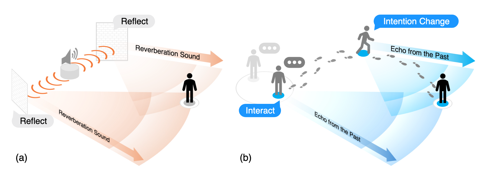

<!--
 * @Author: Conghao Wong
 * @Date: 2024-12-27 11:05:08
 * @LastEditors: Conghao Wong
 * @LastEditTime: 2025-11-17 10:49:38
 * @Github: https://cocoon2wong.github.io
 * Copyright 2024 Conghao Wong, All Rights Reserved.
-->

## Information

This is the homepage of our paper "Reverberation: Learning the Latencies Before Forecasting Trajectories".
The paper is now available on arXiv.
Click the buttons below for more information.

<div style="text-align: center;">
    <!--  -->
    <a class="btn btn-colorful btn-lg" href="./paper">📖 Paper</a>
    <!--  -->
    <a class="btn btn-colorful btn-lg" href="{{ site.github.repository_url }}">🛠️ Code</a>
    <a class="btn btn-colorful btn-lg" href="./guidelines">💡 Code Guidelines</a>
    <br><br>
</div>

## The Echolocation Trilogy

The **Echolocation Trilogy** is our ongoing attempt to understand trajectory forecasting through a simple but profound idea:

> Every future is shaped by echoes of the past, including how they arise, how they collide, and finally how long they endure.

Across three works, we explore this idea from complementary philosophical and computational angles:

<details open>
<summary><strong>Part I — Where do the echoes come from?</strong></summary>

[*SocialCircle*](https://cocoon2wong.github.io/SocialCircle) (CVPR 2024) and [*SocialCirclePlus*](https://cocoon2wong.github.io/SocialCirclePlus) (Journal, Under Review) examine the origins of these echoes: how each agent perceives itself, its surroundings, and the latent intentions embedded in its own motion history.
Here, an echo is the trace of one's presence.
</details>

<details open>
<summary><strong>Part II — How do echoes interact with each other?</strong></summary>

[*Resonance*](https://cocoon2wong.github.io/Re) (ICCV 2025) studies what happens when these echoes coexist.
Rather than treating agents as isolated predictors, we model their futures as **co-vibrations**: intertwined ripples of influence, alignment, and negotiation within shared space.
</details>

<details open>
<summary><strong>Part III — How long do the echoes last?</strong></summary>

[*Reverberation*](https://cocoon2wong.github.io/Rev) (Journal, Under Review) turns to temporality itself: how long the past should be allowed to persist, how memory decays, and when an old echo continues to matter for shaping what comes next.
</details>


Together, these works form a unified, echo-inspired view of trajectory prediction.
All repositories share the same training engine, and the model weights remain compatible in release order.
Reverberation is recommended as the most comprehensive entry point.
To run any model, simply place the core model folders (`SocialCircle`, `Re`, `Rev`, etc.) into the repository root (where `qpid` is located) and train or evaluate via `main.py`.

## Abstract



*Fig. Motivation Illustration: Inspired by the acoustic reverberation that describes how the echo sound decays in the space after reflecting, we model how past trajectory-changing events (like intention changes or interactions) change trajectories as well as their latencies as "echoes from the past".*

Bridging the past to the future, connecting agents both spatially and temporally, lies at the core of the trajectory prediction task.
Despite great efforts, it remains challenging to explicitly learn and predict *latencies*, the temporal delays with which agents respond to different trajectory-changing events and adjust their future paths, whether on their own or interactively.
Different agents may exhibit distinct latency preferences for noticing, processing, and reacting to any specific trajectory-changing event.
The lack of consideration of such latencies may undermine the causal continuity of the forecasting system and also lead to implausible or unintended trajectories.
Inspired by the reverberation curves in acoustics, we propose a new reverberation transform and the corresponding *Reverberation* (short for *Rev*) trajectory prediction model, which simulates and predicts different latency preferences of each agent as well as their stochasticity by using two explicit and learnable reverberation kernels, allowing for the controllable trajectory prediction based on these forecasted latencies.
Experiments on multiple datasets, whether pedestrians or vehicles, demonstrate that *Rev* achieves competitive accuracy while revealing interpretable latency dynamics across agents and scenarios.
Qualitative analyses further verify the properties of the proposed reverberation transform, highlighting its potential as a general latency modeling approach.

## Citation

If you find this work useful, it would be grateful to cite our paper!

```bib
@article{wong2025reverberation,
  title={Reverberation: Learning the Latencies Before Forecasting Trajectories},
  author={Wong, Conghao and Zou, Ziqian and Xia, Beihao and You, Xinge},
  journal={arXiv preprint arXiv:2511.11164},
  year={2025}
}
```

## Contact us

Conghao Wong ([@cocoon2wong](https://github.com/cocoon2wong)): conghaowong@icloud.com  
Ziqian Zou ([@LivepoolQ](https://github.com/LivepoolQ)): ziqianzoulive@icloud.com  
Beihao Xia ([@NorthOcean](https://github.com/NorthOcean)): xbh_hust@hust.edu.cn
